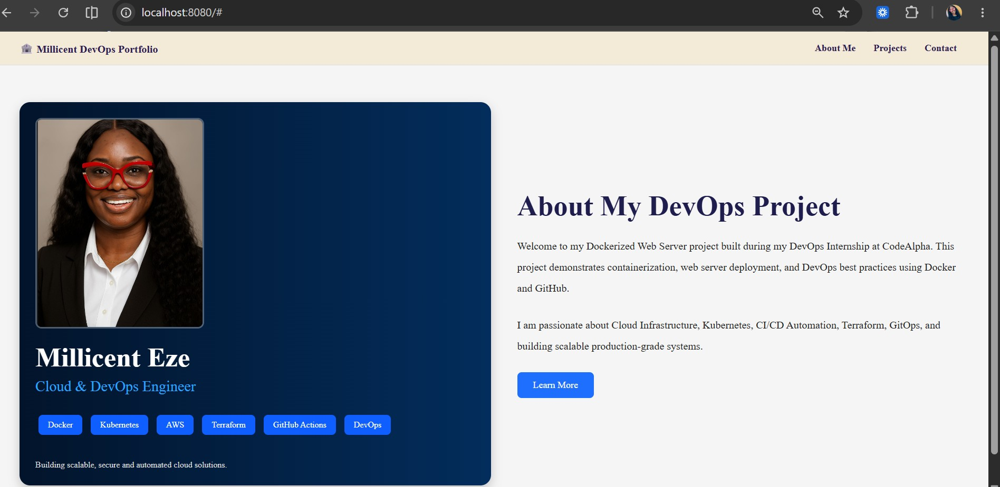
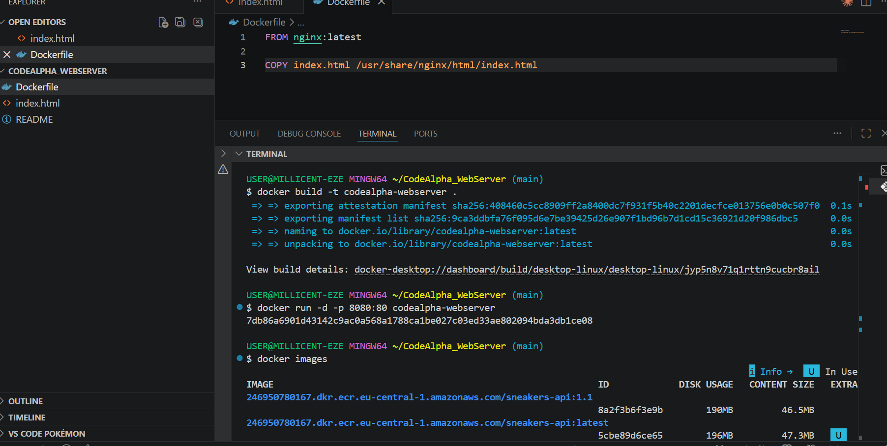
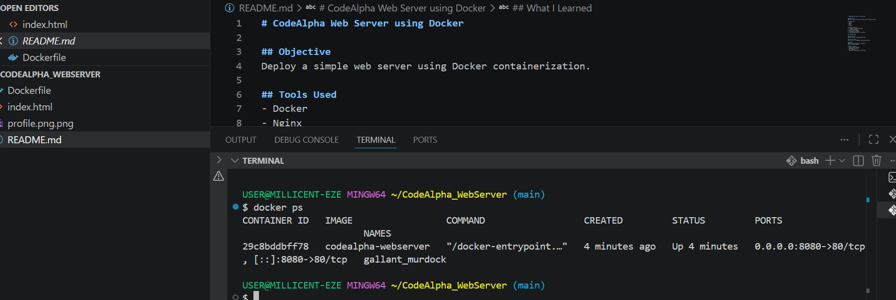
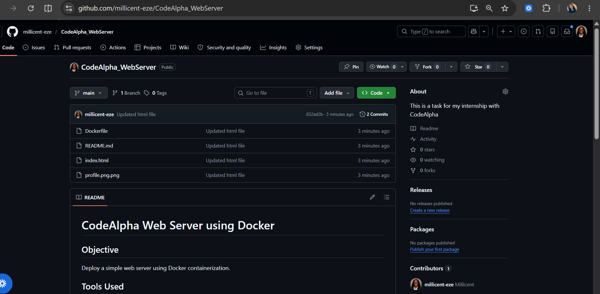
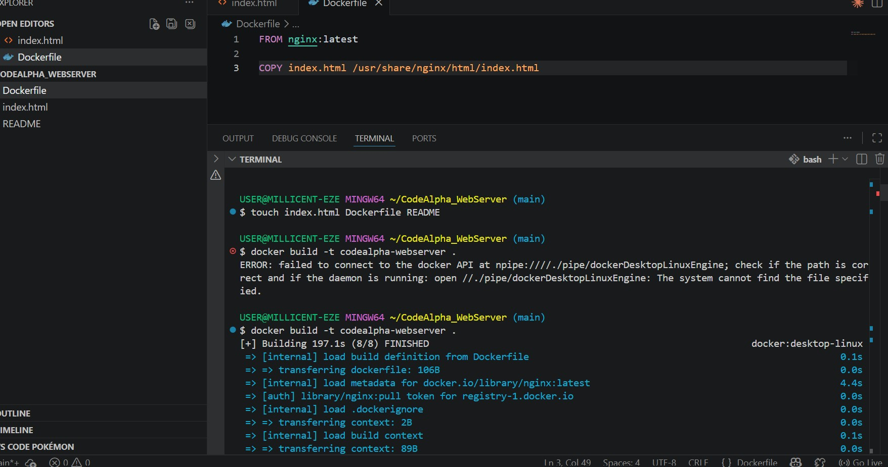

# Dockerized Web Server Portfolio Project 🚀

## Project Overview

This project is a Dockerized portfolio-style web server built during my DevOps Internship at CodeAlpha.

The application demonstrates how to containerize and deploy a static web application using Docker and Nginx while applying modern DevOps practices.

The project also includes a responsive portfolio landing page showcasing my interests in Cloud Infrastructure, DevOps, Kubernetes, Terraform, and CI/CD Automation.

---

# Technologies Used

* Docker
* Nginx
* HTML5
* CSS3
* GitHub
* Git
* VS Code

---

# Features

* Responsive portfolio landing page
* Docker containerization
* Nginx web server deployment
* Professional UI design
* Static asset management
* Custom profile integration
* Modern DevOps workflow

---

# Project Structure

```bash
CodeAlpha_WebServer/
│
├── Dockerfile
├── index.html
├── profile.png.png
├── README.md
│
└── screenshots/
    ├── docker-build-run.png
    ├── docker-running.jpg
    ├── homepage.jpg
    ├── repository.jpg
    ├── terminal-1.jpg
    └── terminal-2.jpg
```

---

# Dockerfile

```dockerfile
FROM nginx:latest

COPY . /usr/share/nginx/html
```

---

# Commands Used

## Build Docker Image

```bash
docker build --no-cache -t codealpha-webserver .
```

## Run Docker Container

```bash
docker run -d -p 8080:80 codealpha-webserver
```

## View Running Containers

```bash
docker ps
```

## Stop Container

```bash
docker stop CONTAINER_ID
```

---

# Application Preview

## Portfolio Landing Page

This screenshot shows the responsive portfolio landing page running successfully inside the Docker container.



---

## Docker Build and Run Process

This screenshot captures the successful Docker image build and container execution commands.



---

## Docker Container Running

This screenshot verifies that the Docker container is actively running and exposing port `8080`.



---

## Repository Structure

This screenshot displays the complete project structure inside VS Code.



---

## Terminal Commands

These screenshots show the Docker commands executed during the project setup and deployment process.




---

# What I Learned

Through this project, I gained practical experience in:

* Docker image creation
* Container deployment
* Nginx configuration
* Static web hosting
* Debugging Docker containers
* Managing static assets inside containers
* GitHub version control
* Responsive web design
* DevOps workflow practices

---
#Live Deployment
# Live Deployment

The application was successfully deployed to Microsoft Azure using Azure Container Registry (ACR) and Azure Container Instances (ACI).

## Cloud Technologies Used

* Microsoft Azure
* Azure CLI
* Azure Container Registry (ACR)
* Azure Container Instances (ACI)
* Docker
* Nginx

#Live Deployment on Azure

## Deployment Features

* Public cloud deployment
* Docker image hosting in Azure
* Azure-managed container infrastructure
* Public DNS exposure
* Production-style deployment workflow

## Live Application URL
http://millicent-devops-app.eastus.azurecontainer.io


---

# Future Improvements

* Add CI/CD pipeline using GitHub Actions
* Deploy application to AWS
* Integrate Kubernetes deployment
* Add custom domain support
* Implement HTTPS with SSL

---

# Author

Millicent Eze
Cloud & DevOps Engineer

GitHub: https://github.com/YOUR_USERNAME

---

# Internship

This project was completed as part of the CodeAlpha DevOps Internship Program.
